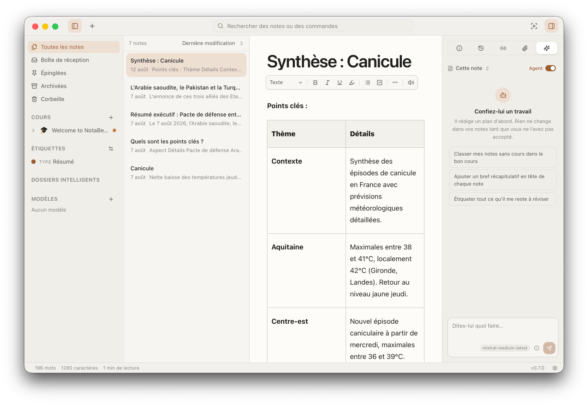
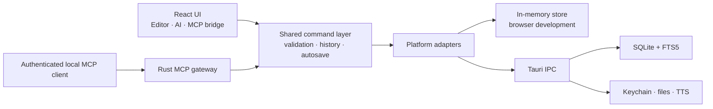

<p align="center">
  
</p>

<h1 align="center">NotaBene</h1>

<p align="center">
  <strong>Your notes. Your Mac. Your intelligence.</strong>
</p>

<p align="center">
  A local-first class-notes app for writing, organizing, understanding, and
  revising—without giving up ownership of your work.
</p>

<p align="center">
  
  
  <a href="https://github.com/kilianvivien/NotaBene/releases/tag/v0.8.5"></a>
  <a href="./LICENSE"></a>
</p>



## Download

Download **[NotaBene 0.8.5 for Apple silicon
(aarch64)](https://github.com/kilianvivien/NotaBene/releases/download/v0.8.5/NotaBene_0.8.5_aarch64.dmg)**.
Requires macOS 13 Ventura or newer.

> [!IMPORTANT]
> The DMG is ad-hoc signed only, so macOS Gatekeeper may warn or block it.
> Signed builds and automatic updates are deferred for now.

## Why NotaBene?

Most note apps make you choose between a capable editor, useful study tools,
and control over your own data. NotaBene is being built so you do not have to.

- **Local by default.** Your notes, attachments, and version history stay on
  your Mac.
- **Made for classes.** Courses, sections, tags, backlinks, maths, drawings,
  and fast search are the point, not add-ons.
- **AI on your terms.** Bring your own key, run a local model, or use no AI at
  all. Nothing a model suggests reaches a note before you have seen it.
- **No account.** There is no NotaBene cloud, no sign-up, and no subscription
  between you and your notes.

## Highlights

| Write                                 | Organize                             | Study                             | Own                           |
| ------------------------------------- | ------------------------------------ | --------------------------------- | ----------------------------- |
| Rich-text and Markdown shortcuts      | Courses, sections, and smart folders | AI summaries and Q&A              | Everything stored on your Mac |
| Abbreviations that expand as you type | Templates for recurring notes        | Flashcard review in the app       | API keys in the Keychain      |
| Tables, callouts, toggles, and code   | Tags you can filter and combine      | Mind maps and flashcards          | Continuous autosave           |
| LaTeX maths and inline images         | `[[wiki links]]` and backlinks       | Anki deck export                  | Version history and recovery  |
| Re-editable Excalidraw drawings       | Command palette and quick notes      | Read aloud and note-to-podcast    | Backups and portable exports  |
| Attachments with in-app preview       | Search across notes and commands     | On-device or hosted neural voices | No account, no telemetry      |
| Import PDF, Word, and slides as notes | Convert an attachment in place       | Optional AI layout for a handout  | Documents converted on-device |
| Select many notes and act on them all | Merge several notes into one         | Study tools read the whole set    | Nothing leaves without asking |
| Tasks, subtasks, and reminders        | Link tasks and notes both ways        | Repeating coursework rolls ahead  | No background service         |

### An editor you can actually take notes in

Headings, lists, tasks, highlights, links, code, tables, collapsible sections,
callouts, LaTeX maths, images, and drawings — with a slash menu, a formatting
toolbar, find and replace, and the Mac shortcuts you already know. It keeps up
with typing during a lecture.

Define your own **abbreviations** in Settings and they expand while you write:
type `tvi`, finish the word, and the note reads "théorème des valeurs
intermédiaires". Expansions never fire inside code, and the words they wrote are
briefly tinted so you can see what happened.

Notes also carry attachments — slide decks, spreadsheets, handouts, lecture
recordings, and e-books all live beside the note instead of in a folder
somewhere else. Images, audio, video, PDF, DOCX, ODT, RTF, Markdown, and
plain-text files open in an in-app viewer with zoom.

For longer work, the **document map** lets you jump between headings and drag
sections into order. Add footnotes and endnotes, set word-count targets for a
note or section, and follow your progress in the status bar. Footnotes,
endnotes, and the document map are also available through the native menu and
keyboard shortcuts.

### Documents you were given, as notes you can edit

**File → Convert a document to note** (⌘⇧O) turns a PDF, Word, PowerPoint,
Excel, OpenDocument, EPUB, RTF, CSV, Markdown, or text file into a real
NotaBene note: headings, paragraphs, lists, tables, embedded images, footnotes,
and endnotes in the editor, ready to annotate. Extraction runs inside the app
on your own Mac — nothing is uploaded and no API key is involved. A file you
have already attached can be converted
in place from the Attachments pane or its preview window, and the original can
stay attached to the note it produced.

Scanned PDFs can be read with **on-device OCR** using Apple's Vision framework.
Only the pages that need recognition are processed, while text from readable
pages is preserved. No model download or API key is needed for OCR.

A converted PDF usually keeps the words and loses the shape, so the import
dialog offers an optional second pass that asks your model to put the layout
back. It is off by default and sends text to your configured provider or local
model. It can add headings and lists but it cannot change your
wording — every edit it proposes is checked against your text first, and any
edit that rewrites something is thrown away rather than applied.

A separate optional AI step turns the imported document into **revision
notes**. You review the proposed changes in the rewrite dialog before accepting
them. Batch imports also preserve links between notes regardless of their
order by writing the batch in one transaction.

### Organization that matches a semester

Build a library from **courses → sections → notes**, then cut across that
hierarchy with namespaced tags such as `topic:`, `prof:`, `semester:`, `exam:`,
and `type:`. Templates make recurring note formats quick to start, while wiki
links and backlinks connect ideas across classes.

Tasks live beside the notes they belong to. Give an assignment a deadline,
priority, reminder, subtasks, and a course; link it to its source note or place
it inline in your prose as a live status chip. Repeating tasks roll forward one
occurrence at a time, and reminders missed while the app was closed arrive
together the next time it opens.

### Work on a whole stack of notes

Command-click to add notes to a selection, shift-click to take a run of them.
A bar above the list then acts on all of them at once: move them to a course,
tag them, export them, archive them, or send them to the trash. Dragging the
selection onto a course in the sidebar files every note in it.

**Merge** folds a selection into one new note (⌥⌘M). The most recently edited
note leads by default, you can rearrange the order before anything is written,
and each note keeps its title as a heading so you can still tell where a
passage came from. The originals go to the trash, get archived, or stay exactly
where they are — your call, every time.

The AI study tools read the selection too, so a revision sheet can be built
from a whole week of lectures rather than one note at a time.

### Search that keeps up

Search covers note titles, bodies, tags, and course names, and ignores accents,
so `resume` finds `résumé`. Filters can be combined:

```text
course:Analysis has:drawing after:2026-01-01
exam:midterm is:pinned
```

The title-bar field and the ⌘K palette run the same search, and both return
commands beside notes — so an action you half-remember is found by typing its
name, with its keyboard shortcut shown next to it.

### Study tools built from your notes

With a provider configured, NotaBene can:

- rewrite or correct a passage, showing you the before and after first;
- turn one or several notes into a summary, revision sheet, or glossary;
- answer questions about a note — strictly from the note (**Note only**), or
  with outside knowledge that is clearly marked as such (**Note + AI**);
- draw a mind map;
- create an editable Excalidraw flowchart or sequence diagram, with a preview
  before insertion;
- write flashcards, review them in the app, and export them to Anki; and
- read a note aloud as a podcast episode you can play, save as MP3, or keep
  attached to the note.

Any of these can be stopped while it is running, and the request is genuinely
called off rather than left to finish out of sight — which is what makes a
local model on your own hardware practical to work with. Smaller local models
are given room to be untidy, too: a structured answer is read past its thinking
and its code fences, and a model that mangles one is shown what it wrote and
asked again. Whatever comes back is validated before it can reach a note.

You can connect Anthropic, OpenAI, Mistral, Gemini, OpenRouter, Ollama, LM
Studio, or any OpenAI-compatible endpoint. Keys are stored in the macOS
Keychain, never in your notes.

Read aloud and spoken episodes use a voice you choose. **macOS system voices**
work offline and are the default. Two better-sounding **neural voices** —
Kokoro 82M and Voxtral 4B — can be downloaded and then run entirely on your
Mac, so the text being spoken never leaves it. Hosted voices from Mistral and
Google are available too, but they are opt-in, are never picked for you, and
send only the text you asked to have read.

### Exports that leave with you

Export a note, a course, a folder, or a selection as:

- Markdown
- HTML
- PDF
- DOCX
- Anki decks for generated flashcards

Drawings and mind maps are preserved in document exports, and secrets are never
included in an export or backup.

For longer documents, **manuscript export** adds a title page, table of contents,
numbered sections, running heads, and figure and table numbering to PDF or
DOCX. Selected notes become chapters in selection order. Footnotes and endnotes
are preserved in Markdown, HTML, PDF, and DOCX exports.

### Agent-ready, without opening your library to the network

NotaBene can let an AI assistant work with your notes through a local
[Model Context Protocol](https://modelcontextprotocol.io/) server. A connected
assistant can search, read, write, move, organize, and archive notes — going
through exactly the same checks and version history as your own typing.

The server never leaves your machine, requires a token to connect, logs what
the assistant did, and has no way to permanently delete anything.

## Privacy model

No accounts, no cloud sync, no telemetry, no analytics, no ads. Taking notes
never needs an internet connection, and documents you import are converted on
your own machine.

NotaBene reaches the network in four situations, all of which you start:

1. an AI request, to the provider or local model you configured;
2. reading text aloud, if you picked a hosted voice over the offline macOS ones;
3. a one-time download, if you choose to install an on-device voice — after
   which it works offline; and
4. checking for a new version.

Whatever a model sends back is treated as untrusted: responses are validated,
and edits are shown to you before they enter a note. API keys live in the macOS
Keychain and cannot end up in a backup or an export.

## Current status

**NotaBene 0.8.5** is available from
[GitHub Releases](https://github.com/kilianvivien/NotaBene/releases/tag/v0.8.5).
Everything described above is built and working.

Two things are deliberately not done yet: the app is **not** signed with an
Apple Developer ID or notarized, and there are **no** automatic updates. Both
are planned.

See the [0.8.5 release notes](https://github.com/kilianvivien/NotaBene/releases/tag/v0.8.5)
and [earlier release notes](./RELEASE_NOTES.md), plus the
[security policy](./SECURITY.md) and
[third-party notices](./THIRD_PARTY_NOTICES.md).

## Getting started

NotaBene currently targets **macOS 13 Ventura or newer**.

### Prerequisites

- [Node.js](https://nodejs.org/) 20 or newer
- [pnpm](https://pnpm.io/)
- A stable [Rust toolchain](https://rustup.rs/)
- Xcode Command Line Tools
- CMake and Ninja, for the on-device speech runtime

```bash
xcode-select --install
brew install cmake ninja
corepack enable
pnpm install
```

`pnpm tauri:dev` and `pnpm tauri:build` first run
`scripts/prepare-crispasr-macos.sh`, which builds the pinned CrispASR/GGML
runtime from source and stages it for signing into the app. The first run
compiles it; later runs reuse the staged copy.

### Run the web UI

```bash
pnpm dev
```

This starts Vite on `http://localhost:5173` with an in-memory adapter. It is
useful for frontend work, but notes do not survive a reload.

### Run the desktop app

```bash
pnpm tauri:dev
```

This launches the complete Tauri app backed by the local SQLite store.

### Build a macOS bundle

```bash
pnpm tauri:build
```

The generated `.app` and `.dmg` artifacts are written under
`src-tauri/target/release/bundle/`.

## Development

### Quality checks

```bash
pnpm typecheck
pnpm lint
pnpm test
pnpm build
```

When Rust code changes:

```bash
cd src-tauri
cargo check
```

Additional commands:

| Command             | Purpose                                 |
| ------------------- | --------------------------------------- |
| `pnpm test:watch`   | Run Vitest in watch mode                |
| `pnpm e2e`          | Run the Playwright end-to-end suite     |
| `pnpm format:check` | Check formatting without changing files |
| `pnpm format`       | Format the repository with Prettier     |
| `pnpm preview`      | Preview the production web build        |

### Architecture at a glance



Four boundaries keep the application predictable:

1. `src/lib/commands/` is the only mutation path.
2. `src/lib/adapters/` isolates browser and Tauri implementations.
3. `src/lib/schema/` validates everything crossing a trust boundary.
4. MCP writes return through the webview and shared command layer, so an
   agent-authored edit receives the same validation and history as a keystroke.

The frontend is built with React 19, TypeScript, Vite, Tailwind CSS, Zustand,
Zod, TipTap, and Excalidraw. The native shell uses Tauri 2 and Rust with
`rusqlite`, FTS5, `rmcp`, and `axum`.

### Repository map

```text
src/
├── app/                 Application shell, dialogs, settings, and feature UI
├── components/glass/    Reusable interface primitives
├── editor/              TipTap editor, extensions, attachments, and Markdown
├── lib/
│   ├── adapters/        Browser/Tauri platform boundary
│   ├── ai/              Providers, prompts, parsing, and AI workflows
│   ├── commands/        The shared mutation and application-command layer
│   ├── export/          Markdown, HTML, PDF, DOCX, and Anki export
│   ├── schema/          Runtime contracts and migrations
│   └── state/           Focused Zustand stores
└── locales/             English and French translations

src-tauri/
└── src/
    ├── db/              SQLite schema, migrations, and repositories
    ├── mcp/             Authenticated local MCP server
    ├── ai.rs            Native AI transport
    └── tts/             macOS and on-device neural speech
```

Read [CLAUDE.md](./CLAUDE.md) before making code changes. It is the source of
truth for architecture rules, conventions, and verification expectations.

## Contributing

Issues, focused pull requests, and thoughtful product feedback are welcome
while NotaBene takes shape. Please:

1. open an issue before beginning a large or architectural change;
2. keep user-facing text available in both English and French;
3. add or update tests for changed behavior; and
4. run the relevant quality checks before submitting a pull request.

Please do not include real notes, API keys, databases, or other personal data
in bug reports and test fixtures.

## Acknowledgements

NotaBene is a small app standing on a lot of other people's work. Copyright
stays with each project's contributors; the list below is attribution, not a
substitute for the licences themselves, which ship in full inside the installed
packages.

| Project                                                                                                                     | Licence                                            | What it does here                       |
| --------------------------------------------------------------------------------------------------------------------------- | -------------------------------------------------- | --------------------------------------- |
| [Tauri](https://tauri.app/)                                                                                                 | Apache-2.0 OR MIT                                  | Native macOS shell and plugins          |
| [rusqlite](https://github.com/rusqlite/rusqlite) / [SQLite](https://sqlite.org/)                                            | MIT / public domain                                | The local library and FTS5 search       |
| [rmcp](https://github.com/modelcontextprotocol/rust-sdk) / [axum](https://github.com/tokio-rs/axum)                         | Apache-2.0 / MIT                                   | The authenticated local MCP server      |
| [Tokio](https://tokio.rs/) / [reqwest](https://github.com/seanmonstar/reqwest) / [rustls](https://github.com/rustls/rustls) | MIT / Apache-2.0 OR MIT / Apache-2.0 OR ISC OR MIT | Async runtime and AI provider transport |
| [React](https://react.dev/)                                                                                                 | MIT                                                | Interface runtime                       |
| [TipTap](https://tiptap.dev/) / [ProseMirror](https://prosemirror.net/)                                                     | MIT                                                | The authoring surface                   |
| [Excalidraw](https://excalidraw.com/)                                                                                       | MIT                                                | Re-editable drawings                    |
| [KaTeX](https://katex.org/)                                                                                                 | MIT                                                | LaTeX maths rendering                   |
| [Tailwind CSS](https://tailwindcss.com/)                                                                                    | MIT                                                | Styling toolchain                       |
| [Lucide](https://lucide.dev/)                                                                                               | ISC                                                | Interface icons                         |
| [Zustand](https://github.com/pmndrs/zustand) / [Immer](https://immerjs.github.io/immer/)                                    | MIT                                                | Application state                       |
| [Zod](https://zod.dev/)                                                                                                     | MIT                                                | Runtime schema validation               |
| [i18next](https://www.i18next.com/)                                                                                         | MIT                                                | English and French localization         |
| [AnyDoc](https://crates.io/crates/anydoc)                                                                                   | MIT                                                | Local document import                   |
| [PDF.js](https://mozilla.github.io/pdf.js/)                                                                                 | Apache-2.0                                         | In-app PDF preview                      |
| [docx-preview](https://github.com/VolodymyrBaydalka/docxjs)                                                                 | Apache-2.0                                         | In-app DOCX preview                     |
| [docx](https://docx.js.org/) / [pdfmake](https://pdfmake.github.io/docs/)                                                   | MIT                                                | Word and PDF export                     |
| [fflate](https://github.com/101arrowz/fflate)                                                                               | MIT                                                | Backups and portable archives           |
| [CrispASR](https://github.com/CrispStrobe/CrispASR) / [GGML](https://github.com/ggml-org/ggml)                              | MIT                                                | On-device neural speech runtime         |
| [wasm-media-encoders](https://github.com/arseneyr/wasm-media-encoders)                                                      | MIT                                                | Local MP3 podcast encoding              |
| [Lora](https://fonts.google.com/specimen/Lora)                                                                              | SIL OFL 1.1                                        | The bundled typeface                    |

Speech models are **not** bundled or redistributed. If you choose to install
one, it is downloaded from a pinned Hugging Face revision under its own terms:
**Kokoro 82M** under Apache-2.0, with voice packs and pronunciation
dictionaries under MIT, and **Voxtral 4B** under CC BY-NC 4.0, which restricts
it to non-commercial use.

[THIRD_PARTY_NOTICES.md](./THIRD_PARTY_NOTICES.md) holds the complete notices.

## License

NotaBene is available under the [Apache License 2.0](./LICENSE).
