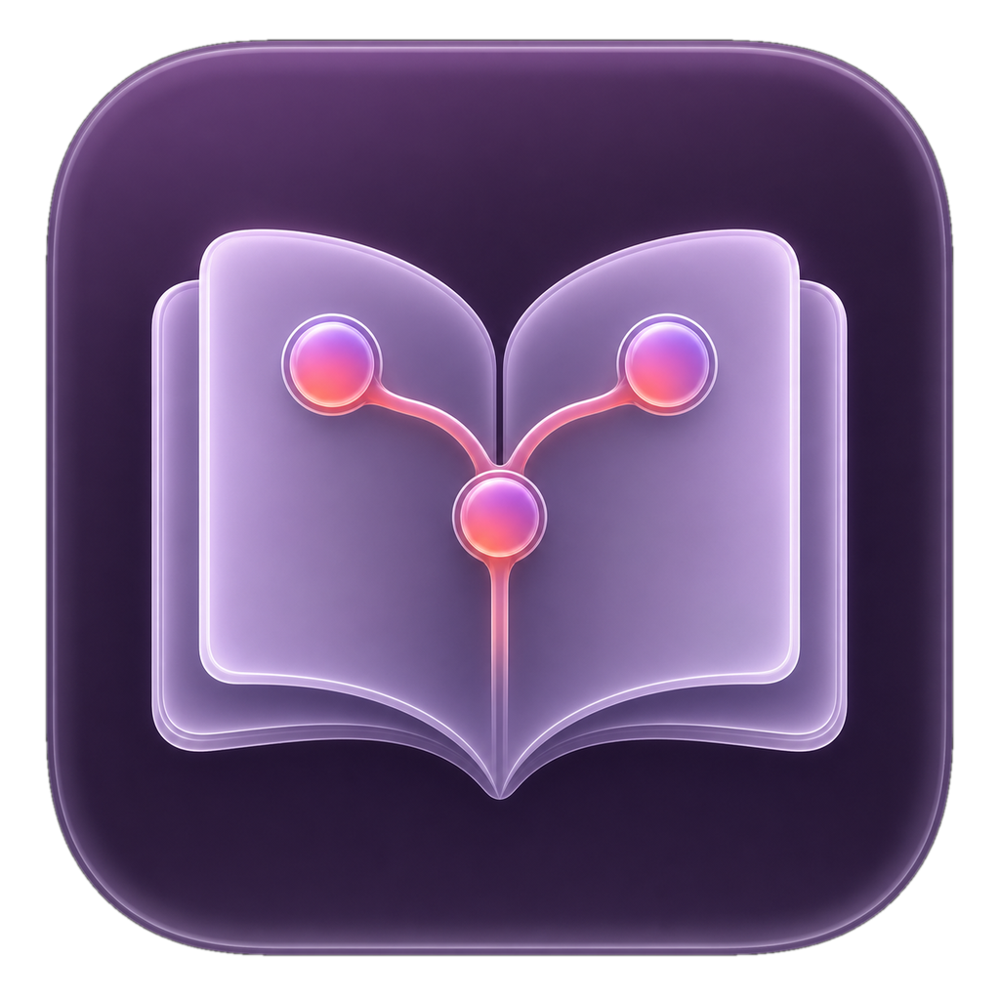
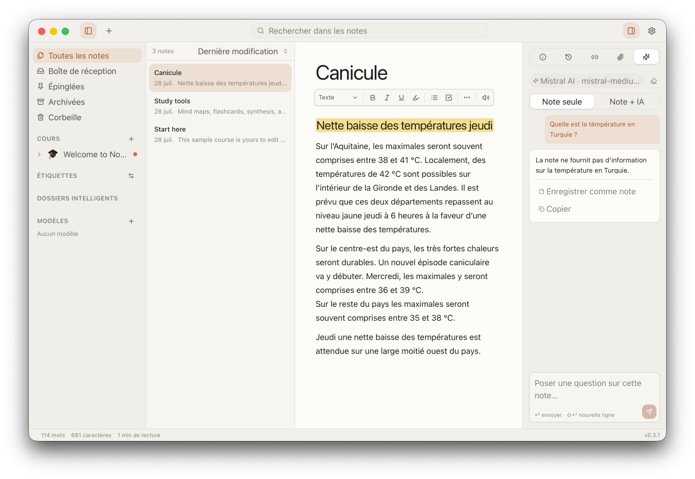
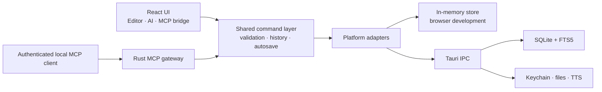

<p align="center">
  
</p>

<h1 align="center">NotaBene</h1>

<p align="center">
  <strong>Your notes. Your Mac. Your intelligence.</strong>
</p>

<p align="center">
  A local-first class-notes app for writing, organizing, understanding, and
  revising—without giving up ownership of your work.
</p>

<p align="center">
  
  
  <a href="https://github.com/kilianvivien/NotaBene/releases/tag/v0.4.0"></a>
  <a href="./LICENSE"></a>
</p>



## Download

Download **[NotaBene 0.4.0 for Apple silicon
(aarch64)](https://github.com/kilianvivien/NotaBene/releases/download/v0.4.0/NotaBene_0.4.0_aarch64.dmg)**.
NotaBene requires macOS 13 Ventura or newer.

> [!IMPORTANT]
> The 0.4.0 DMG is ad-hoc signed only — it is not Developer ID signed or
> notarized, so macOS Gatekeeper may warn or block it. Signed builds and
> automatic updates are intentionally deferred.

## Why NotaBene?

Most note apps make you choose between a capable editor, useful study tools,
and control over your own data. NotaBene is being built so you do not have to.

- **Local by default.** Notes, attachments, versions, and settings stay on your
  Mac in a local SQLite library.
- **Made for classes.** Courses, sections, typed tags, backlinks, maths,
  drawings, and fast full-text search are first-class features.
- **AI on your terms.** Bring your own API key, connect a local model, or use no
  AI at all. Suggested edits always pass through a preview.
- **No account required.** There is no NotaBene cloud, analytics pipeline, or
  subscription standing between you and your notes.

## Highlights

| Write                                 | Organize                             | Study                             | Own                          |
| ------------------------------------- | ------------------------------------ | --------------------------------- | ---------------------------- |
| Rich-text and Markdown shortcuts      | Courses, sections, and smart folders | AI synthesis and Q&A              | Local SQLite + FTS5          |
| Abbreviations that expand as you type | Templates for recurring notes        | Flashcard review in the app       | API keys in the Keychain     |
| Tables, callouts, toggles, and code   | Typed, facetable tags                | Mind maps and flashcards          | Continuous autosave          |
| LaTeX maths and inline images         | `[[wiki links]]` and backlinks       | Anki deck export                  | Version history and recovery |
| Re-editable Excalidraw drawings       | Command palette and quick notes      | Read aloud and note-to-podcast    | Backups and portable exports |
| Attachments with in-app preview       | Search across notes and commands     | On-device or hosted neural voices | No account, no telemetry     |

### A serious authoring surface

NotaBene uses TipTap and ProseMirror to provide a responsive, keyboard-friendly
editor with headings, lists, tasks, highlights, links, code blocks, tables,
collapsible sections, callouts, LaTeX maths, images, and drawings. A slash menu,
formatting toolbar, find and replace, and native shortcuts keep common actions
close at hand.

Define your own **abbreviations** in Settings and they expand while you write:
type `tvi`, finish the word, and the note reads "théorème des valeurs
intermédiaires". A shortcut only fires at the end of a word and never inside
code, a lower-case one also matches its capitalised spelling, and the words it
wrote are briefly tinted so an expansion is never mistaken for your own typo.

Notes also carry attachments. Images, audio, video, PDF, DOCX, ODT, RTF,
Markdown, and plain-text files open in an in-app viewer with zoom, so course
handouts and recordings live beside the note instead of in a folder somewhere
else.

### Organization that matches a semester

Build a library from **courses → sections → notes**, then cut across that
hierarchy with namespaced tags such as `topic:`, `prof:`, `semester:`, `exam:`,
and `type:`. Templates make recurring note formats quick to start, while wiki
links and backlinks connect ideas across classes.

### Search that keeps up

SQLite FTS5 searches titles, note bodies, tags, and course names. Search is
diacritics-insensitive—`resume` can find `résumé`—and accepts composable filters:

```text
course:Analysis has:drawing after:2026-01-01
exam:midterm is:pinned
```

The title-bar field and the ⌘K palette run the same search, and both return
commands beside notes — so an action you half-remember is found by typing its
name, with its keyboard shortcut shown next to it.

### Study tools built from your notes

With a provider configured, NotaBene can:

- rewrite or correct a selection with a before/after diff;
- synthesize one or more notes into structured material;
- answer questions about the open note, either strictly from the note
  (**Note only**) or with clearly labelled outside knowledge (**Note + AI**);
- generate a visual mind map;
- create basic and cloze flashcards, then export them to Anki; and
- turn a note into a spoken episode you can play in the app, export as MP3, or
  attach to the note itself.

Supported AI connections include Anthropic, OpenAI, Mistral, Gemini,
OpenRouter, Ollama, LM Studio, and custom OpenAI-compatible endpoints. API keys
are stored in the macOS Keychain, not in the note database.

Read aloud and spoken episodes run on a selectable speech engine. **macOS
system voices** are the offline default. Two optional **on-device neural
models** run entirely on Apple Silicon through a native runtime bundled with
the app — **Kokoro 82M** (153 MB, one English and one French voice) and
**Voxtral 4B** (2.35 GB, seven preset English and French voices) — so the text
being spoken never leaves your Mac. Each is downloaded from a pinned revision,
verified by checksum, and installed only once you accept its licence; it can be
tested, unloaded, or removed at any time.

The hosted neural voices of **Voxtral TTS (Mistral)** and **Gemini TTS
(Google)** remain available for anyone who prefers them. The cloud engines are
opt-in, are never chosen as a fallback, and send only the text you ask to have
spoken.

### Exports that leave with you

Export a note, course, folder, or selection as:

- Markdown
- HTML
- PDF
- DOCX
- Anki decks for generated flashcards

Drawings and mind maps are preserved in document exports, and secrets are never
included in an export or backup.

### Agent-ready, without opening your library to the network

NotaBene includes an authenticated local
[Model Context Protocol](https://modelcontextprotocol.io/) server. Compatible
clients can search, read, create, update, move, organize, and archive notes
through the same validated command layer used by the app.

The server binds to loopback only, requires a token, records agent activity,
uses optimistic concurrency protection, and deliberately exposes no permanent
delete operation.

## Privacy model

NotaBene has no accounts, cloud sync, telemetry, advertising, or analytics.
Normal note-taking does not require an internet connection.

Network access is limited to services that are visible and initiated by you:

1. the AI provider or local-model endpoint you configure;
2. a hosted speech engine, if you explicitly select one instead of the offline
   macOS voices;
3. a one-time download from Hugging Face, if you choose to install an
   on-device speech model — after which that engine works offline; and
4. the application update check.

AI output is treated as untrusted input: structured responses are validated,
and edits are previewed before they enter a note. API keys live in the macOS
Keychain and cannot be represented in the backup schema.

## Current status

NotaBene 0.4.0 is available from
[GitHub Releases](https://github.com/kilianvivien/NotaBene/releases/tag/v0.4.0).
The product foundation and phases A–H are code-complete, except for the
explicitly deferred signing, notarization, and signed-update work:

- native shell and local persistence;
- rich authoring, with attachments and in-app document preview;
- course organization and full-text search;
- versions, recovery, backups, and exports;
- bring-your-own-key and local-model AI, including note-only and
  note-plus-knowledge answer modes;
- the authenticated MCP integration;
- editable mind maps with image/outline export, flashcard review, and spoken
  episodes on on-device, system, or hosted voices; and
- first-run guidance, EN/FR coverage, keyboard accessibility, and local
  performance instrumentation.

0.3.x focused on making those features hold up in daily use: audio generation
and playback, attachment handling and previews, a reworked Ask panel, working
equations in the desktop build, and user-defined abbreviations. 0.4.0 brings
speech back in line with the rest of the product — neural voices that run on
your own machine, with no key and no upload.

See [release notes](./RELEASE_NOTES.md), the [security policy](./SECURITY.md),
and [third-party notices](./THIRD_PARTY_NOTICES.md).

## Getting started

NotaBene currently targets **macOS 13 Ventura or newer**.

### Prerequisites

- [Node.js](https://nodejs.org/) 20 or newer
- [pnpm](https://pnpm.io/)
- A stable [Rust toolchain](https://rustup.rs/)
- Xcode Command Line Tools
- CMake and Ninja, for the on-device speech runtime

```bash
xcode-select --install
brew install cmake ninja
corepack enable
pnpm install
```

`pnpm tauri:dev` and `pnpm tauri:build` first run
`scripts/prepare-crispasr-macos.sh`, which builds the pinned CrispASR/GGML
runtime from source and stages it for signing into the app. The first run
compiles it; later runs reuse the staged copy.

### Run the web UI

```bash
pnpm dev
```

This starts Vite on `http://localhost:5173` with an in-memory adapter. It is
useful for frontend work, but notes do not survive a reload.

### Run the desktop app

```bash
pnpm tauri:dev
```

This launches the complete Tauri app backed by the local SQLite store.

### Build a macOS bundle

```bash
pnpm tauri:build
```

The generated `.app` and `.dmg` artifacts are written under
`src-tauri/target/release/bundle/`.

## Development

### Quality checks

```bash
pnpm typecheck
pnpm lint
pnpm test
pnpm build
```

When Rust code changes:

```bash
cd src-tauri
cargo check
```

Additional commands:

| Command             | Purpose                                 |
| ------------------- | --------------------------------------- |
| `pnpm test:watch`   | Run Vitest in watch mode                |
| `pnpm e2e`          | Run the Playwright end-to-end suite     |
| `pnpm format:check` | Check formatting without changing files |
| `pnpm format`       | Format the repository with Prettier     |
| `pnpm preview`      | Preview the production web build        |

### Architecture at a glance



Four boundaries keep the application predictable:

1. `src/lib/commands/` is the only mutation path.
2. `src/lib/adapters/` isolates browser and Tauri implementations.
3. `src/lib/schema/` validates everything crossing a trust boundary.
4. MCP writes return through the webview and shared command layer, so an
   agent-authored edit receives the same validation and history as a keystroke.

The frontend is built with React 19, TypeScript, Vite, Tailwind CSS, Zustand,
Zod, TipTap, and Excalidraw. The native shell uses Tauri 2 and Rust with
`rusqlite`, FTS5, `rmcp`, and `axum`.

### Repository map

```text
src/
├── app/                 Application shell, dialogs, settings, and feature UI
├── components/glass/    Reusable interface primitives
├── editor/              TipTap editor, extensions, attachments, and Markdown
├── lib/
│   ├── adapters/        Browser/Tauri platform boundary
│   ├── ai/              Providers, prompts, parsing, and AI workflows
│   ├── commands/        The shared mutation and application-command layer
│   ├── export/          Markdown, HTML, PDF, DOCX, and Anki export
│   ├── schema/          Runtime contracts and migrations
│   └── state/           Focused Zustand stores
└── locales/             English and French translations

src-tauri/
└── src/
    ├── db/              SQLite schema, migrations, and repositories
    ├── mcp/             Authenticated local MCP server
    ├── ai.rs            Native AI transport
    └── tts/             macOS and on-device neural speech
```

Read [CLAUDE.md](./CLAUDE.md) before making code changes. It is the source of
truth for architecture rules, conventions, and verification expectations.

## Contributing

Issues, focused pull requests, and thoughtful product feedback are welcome
while NotaBene takes shape. Please:

1. open an issue before beginning a large or architectural change;
2. keep user-facing text available in both English and French;
3. add or update tests for changed behavior; and
4. run the relevant quality checks before submitting a pull request.

Please do not include real notes, API keys, databases, or other personal data
in bug reports and test fixtures.

## License

NotaBene is available under the [Apache License 2.0](./LICENSE).
