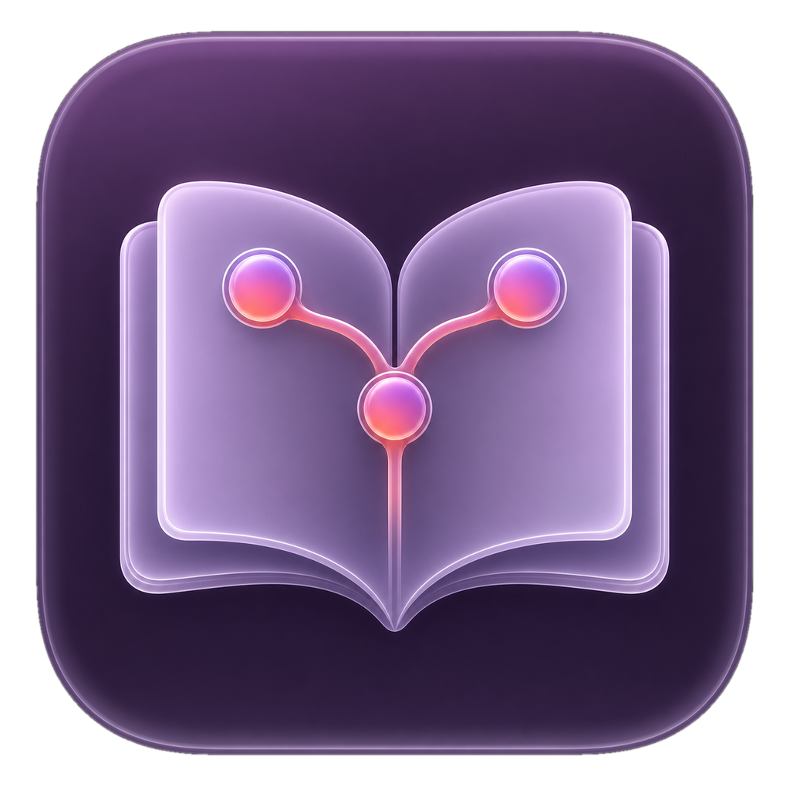
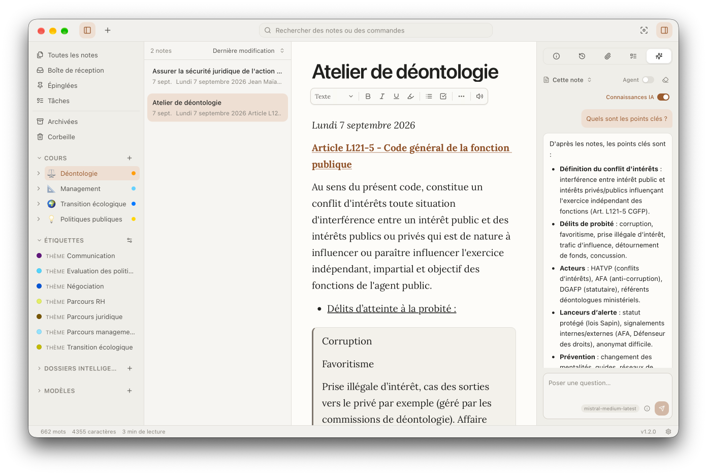
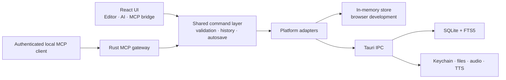

<p align="center">
  
</p>

<h1 align="center">NotaBene</h1>

<p align="center">
  <strong>Your notes. Your Mac. Your intelligence.</strong>
</p>

<p align="center">
  A note-taking app for the Mac, made for students. Take notes in class, keep
  them organized by course, and turn them into revision material, with
  everything stored on your own Mac.
</p>

<p align="center">
  
  
  <a href="https://github.com/kilianvivien/NotaBene/releases/tag/v1.3.9"></a>
  <a href="./LICENSE"></a>
</p>



## What NotaBene is for

NotaBene follows a class from the lecture to the exam:

1. **In the lecture, write fast** — and record the lecture if you like. Each
   paragraph remembers the moment it was typed, so you can replay what the
   lecturer said about it or turn the recording into a linked transcript.
2. **After class, file it.** Courses, sections, tags, `[[wiki links]]` and
   attachments. A PDF or Word handout can become an editable note.
3. **Before the deadline, see what is due.** Tasks with reminders and repeats,
   in and out of Apple Calendar, Moodle or Canvas.
4. **Before the exam, revise from what you wrote.** Instant search,
   flashcards (in the app or Anki), revision sheets, mind maps, podcasts, and
   questions answered from your notes.

The AI tools are optional. Everything else works without an account, a
subscription or a connection.

**Who it is for.** Students first; graduate students and researchers too —
bring a library from Obsidian, Markdown or Notion, write long documents with
footnotes, and annotate PDFs.

**What it is not.** A Mac app only, with no iPhone, iPad or web version, no
cloud sync and no collaboration. Your library is a folder on your Mac.

## Download

**[NotaBene 1.3.9 for Apple silicon](https://github.com/kilianvivien/NotaBene/releases/download/v1.3.9/NotaBene_1.3.9_aarch64.dmg)**
— macOS 13 Ventura or newer. On-device transcription needs macOS 26 or newer;
on older versions, transcription is available through Mistral with your own
API key. Apple Intelligence as a provider needs macOS 27.

> [!IMPORTANT]
> The DMG is ad-hoc signed and not notarized, so Gatekeeper may block it. Go to
> System Settings → Privacy & Security and choose **Open Anyway**. There are no
> automatic updates yet.

A first launch offers a short tour and asks how to begin: import your notes,
explore a sample course, or start empty. Help → NotaBene help (⇧⌘/) covers the
rest.

## Features

| Write                                 | Organize                              | Study                              | Own                              |
| ------------------------------------- | ------------------------------------- | ---------------------------------- | -------------------------------- |
| Rich text with Markdown shortcuts     | Courses, sections, and smart folders  | AI summaries and Q&A with sources  | Everything stored on your Mac    |
| Lecture recording anchored to blocks  | Namespaced tags you can combine       | Audio transcription and flashcards | API keys in the Keychain         |
| LaTeX maths, tables, callouts, code   | `[[wiki links]]` and backlinks        | Mind maps and diagrams             | Autosave and version history     |
| Re-editable Excalidraw drawings       | Tasks, subtasks, and reminders        | Read aloud and note-to-podcast     | Backups and portable exports     |
| Abbreviations and word completion     | Calendar import and export (`.ics`)   | Define a term in context           | Images stripped of location data |
| PDF, Word, and slides as notes (+OCR) | Bulk select, move, tag, and merge     | Study tools over a whole selection | No account, no telemetry         |
| Attachments and saved web pages       | Import Obsidian, Markdown, and Notion | An agent for multi-step jobs       | Nothing leaves without asking    |

**Editor.** Slash menu, toolbar, find and replace, footnotes and endnotes, a
document map, and word-count targets. Abbreviations expand as you type
(`tvi` → "théorème des valeurs intermédiaires"), and word completion learns
each course's vocabulary — Tab to accept, never inserted on its own.
Right-click a word or selection for clipboard, formatting, links and vocabulary
commands, or use Correct selection and Rewrite selection to review an AI
proposal for just that passage. Shift-right-click opens the native macOS menu.

**Lecture recording.** ⌥⌘R records into the open note. Every paragraph or
heading started during the recording gets a marker that plays from two
seconds before it. Audio stays on your Mac as an attachment; Settings →
Recording picks the microphone and level. A five-second microphone warm-up
precedes recording, so the countdown is not saved in the audio.

**Transcription.** Transcribe a lecture recording or another audio attachment
from its player (⇧⌥⌘R). Add the transcript to the note or create a linked note;
each paragraph can play the corresponding audio, and uncertain words are
highlighted for review. On macOS 26+, Apple's speech recognition runs on this
Mac after you install its language assets in Settings → Recording. Mistral is
an optional hosted choice that sends audio to its API using your key.

**Documents and imports.** File → Convert a document to note (⌘⇧O) turns PDF,
Word, PowerPoint, Excel, OpenDocument, EPUB and more into editable notes,
on-device, with Vision OCR for scans. File → Import notes from another app
(⇧⌥⌘O) brings in an Obsidian vault, a Markdown folder or a Notion export,
with a preview first, links intact, and re-imports that update instead of
duplicating.

**Search.** Titles, bodies, tags and courses, accent-insensitive, with
filters such as `course:Analysis has:drawing after:2026-01-01`. ⌘K finds
commands beside notes.

**Visualize.** Turn a note into a focused mind map or a diagram that explains
steps, decisions, dependencies or feedback loops. The preview shows the
learning question and takeaway, with the reasoning behind the structure and
what was left out. Generated mind maps stay shallow and selective; longer
explanations appear below the tree. Both outputs remain editable and export
with the note.

**AI, on your terms.** Anthropic, OpenAI, Mistral, Gemini, OpenRouter, Ollama,
LM Studio, Apple Intelligence on-device, or any OpenAI-compatible endpoint —
or none. Every edit a model proposes is shown before it reaches a note, and
anything it returns is validated. Voices can be macOS system voices, on-device
neural voices (Kokoro, Voxtral), or opt-in hosted ones. Gemini text-to-speech
uses the main Gemini API key, and hosted Voxtral uses the main Mistral API key;
configure each key once in Settings → AI Providers.

**Agent and MCP.** A local, token-protected
[Model Context Protocol](https://modelcontextprotocol.io/) server lets an
assistant search, read, write, organize and archive notes through the same
checks and history as your own typing, and never delete permanently. The
in-app Agent uses the same 29 tools: it plans first, can run the study
features, asks when a job is ambiguous, holds large bulk changes for your
approval, and undoes as one step.

**Exports.** Markdown, HTML, PDF, DOCX and Anki, for a note, a course or a
selection. Manuscript export adds a title page, contents and numbering.
Secrets never appear in an export or backup.

## Privacy

No accounts, cloud sync, telemetry, analytics or ads. NotaBene reaches the
network only when you ask it to: an AI request to the provider you chose (local
models and Apple Intelligence stay on your Mac), hosted transcription or voice,
a one-time voice download, saving a web page, or checking for a new version. AI requests
go only to built-in providers, your own machine, or an address you approved.

## Status

**NotaBene 1.3.9** is a maintenance release: security fixes and updated
foundations, with no feature changes — see the
[release notes](./RELEASE_NOTES.md). The app is not yet signed with a
Developer ID or notarized, and has no automatic updates.

See also the [security policy](./SECURITY.md) and
[third-party notices](./THIRD_PARTY_NOTICES.md).

## Build from source

Requires macOS 13+, Node.js 20+, pnpm, a stable Rust toolchain, Xcode Command
Line Tools, and CMake and Ninja (for the on-device speech runtime).

```bash
xcode-select --install
brew install cmake ninja
corepack enable
pnpm install
```

| Command            | What it does                                                   |
| ------------------ | -------------------------------------------------------------- |
| `pnpm dev`         | Web UI on `localhost:5173` with an in-memory store (no saving) |
| `pnpm tauri:dev`   | The full desktop app with SQLite                               |
| `pnpm tauri:build` | `.app` and `.dmg` under `src-tauri/target/release/bundle/`     |

The first Tauri run builds the pinned CrispASR/GGML runtime
(`scripts/prepare-crispasr-macos.sh`); later runs reuse it.

## Development

Before a pull request, run `pnpm typecheck && pnpm lint && pnpm test`, plus
`cargo check` in `src-tauri/` when Rust changed. `pnpm e2e` runs the
Playwright suite and `pnpm format` applies Prettier.


```mermaid
flowchart LR
    UI["React UI<br/>Editor · AI · MCP bridge"] --> CMD["Shared command layer<br/>validation · history · autosave"]
    CMD --> ADAPTERS["Platform adapters"]
    ADAPTERS --> MEMORY["In-memory store<br/>browser development"]
    ADAPTERS --> TAURI["Tauri IPC"]
    TAURI --> DB["SQLite + FTS5"]
    TAURI --> OS["Keychain · files · audio · TTS"]
    MCP["Authenticated local MCP client"] --> GATEWAY["Rust MCP gateway"]
    GATEWAY --> CMD
```

Four boundaries keep the app predictable:

1. `src/lib/commands/` is the only mutation path.
2. `src/lib/adapters/` isolates browser and Tauri implementations.
3. `src/lib/schema/` validates everything crossing a trust boundary.
4. MCP writes return through the webview and the command layer, so an agent's
   edit gets the same validation and history as a keystroke.

React 19, TypeScript, Vite, Tailwind CSS, Zustand, Zod, TipTap and Excalidraw
in front; Tauri 2 and Rust with `rusqlite`, FTS5, `rmcp` and `axum` behind.
Read [CLAUDE.md](./CLAUDE.md) before changing code.

## Contributing

Issues, focused pull requests and product feedback are welcome. Open an issue
before a large change, keep user-facing text in both English and French, add
tests for changed behaviour, and never include real notes, keys or personal
data in reports or fixtures.

## Acknowledgements

NotaBene stands on a lot of other people's work. Copyright stays with each
project's contributors; this list is attribution, not a substitute for the
licences, which ship in full inside the installed packages.

| Project                                                                                                                     | Licence                                            | What it does here                       |
| --------------------------------------------------------------------------------------------------------------------------- | -------------------------------------------------- | --------------------------------------- |
| [Tauri](https://tauri.app/)                                                                                                 | Apache-2.0 OR MIT                                  | Native macOS shell and plugins          |
| [rusqlite](https://github.com/rusqlite/rusqlite) / [SQLite](https://sqlite.org/)                                            | MIT / public domain                                | The local library and FTS5 search       |
| [rmcp](https://github.com/modelcontextprotocol/rust-sdk) / [axum](https://github.com/tokio-rs/axum)                         | Apache-2.0 / MIT                                   | The authenticated local MCP server      |
| [Tokio](https://tokio.rs/) / [reqwest](https://github.com/seanmonstar/reqwest) / [rustls](https://github.com/rustls/rustls) | MIT / Apache-2.0 OR MIT / Apache-2.0 OR ISC OR MIT | Async runtime and AI provider transport |
| [React](https://react.dev/)                                                                                                 | MIT                                                | Interface runtime                       |
| [TipTap](https://tiptap.dev/) / [ProseMirror](https://prosemirror.net/)                                                     | MIT                                                | The authoring surface                   |
| [Excalidraw](https://excalidraw.com/)                                                                                       | MIT                                                | Re-editable drawings                    |
| [KaTeX](https://katex.org/)                                                                                                 | MIT                                                | LaTeX maths rendering                   |
| [Tailwind CSS](https://tailwindcss.com/)                                                                                    | MIT                                                | Styling toolchain                       |
| [Lucide](https://lucide.dev/)                                                                                               | ISC                                                | Interface icons                         |
| [Zustand](https://github.com/pmndrs/zustand) / [Immer](https://immerjs.github.io/immer/)                                    | MIT                                                | Application state                       |
| [Zod](https://zod.dev/)                                                                                                     | MIT                                                | Runtime schema validation               |
| [i18next](https://www.i18next.com/)                                                                                         | MIT                                                | English and French localization         |
| [AnyDoc](https://crates.io/crates/anydoc)                                                                                   | MIT                                                | Local document import                   |
| [PDF.js](https://mozilla.github.io/pdf.js/)                                                                                 | Apache-2.0                                         | In-app PDF preview                      |
| [docx-preview](https://github.com/VolodymyrBaydalka/docxjs)                                                                 | Apache-2.0                                         | In-app DOCX preview                     |
| [docx](https://docx.js.org/) / [pdfmake](https://pdfmake.github.io/docs/)                                                   | MIT                                                | Word and PDF export                     |
| [fflate](https://github.com/101arrowz/fflate)                                                                               | MIT                                                | Backups and portable archives           |
| [CrispASR](https://github.com/CrispStrobe/CrispASR) / [GGML](https://github.com/ggml-org/ggml)                              | MIT                                                | On-device neural speech runtime         |
| [wasm-media-encoders](https://github.com/arseneyr/wasm-media-encoders)                                                      | MIT                                                | Local MP3 podcast encoding              |
| [Lora](https://fonts.google.com/specimen/Lora)                                                                              | SIL OFL 1.1                                        | The bundled typeface                    |

Speech models are not bundled. If you install one, it is downloaded from a
pinned Hugging Face revision under its own terms: **Kokoro 82M** (Apache-2.0;
voice packs and dictionaries MIT) and **Voxtral 4B** (CC BY-NC 4.0,
non-commercial only). [THIRD_PARTY_NOTICES.md](./THIRD_PARTY_NOTICES.md) holds
the complete notices.

## License

NotaBene is available under the [Apache License 2.0](./LICENSE).
